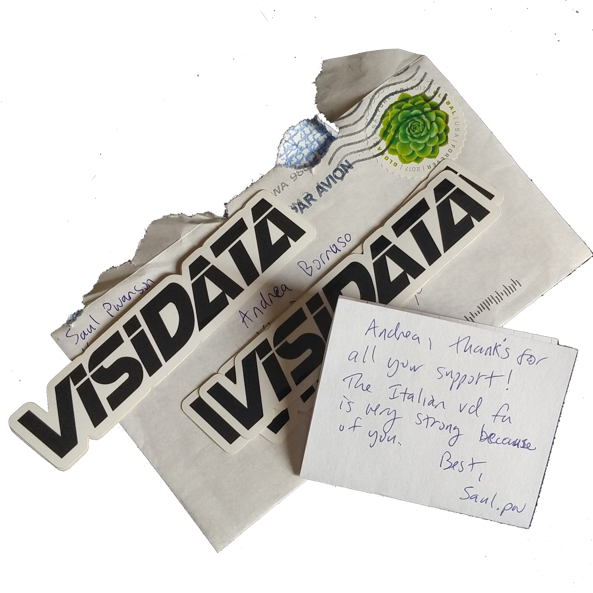
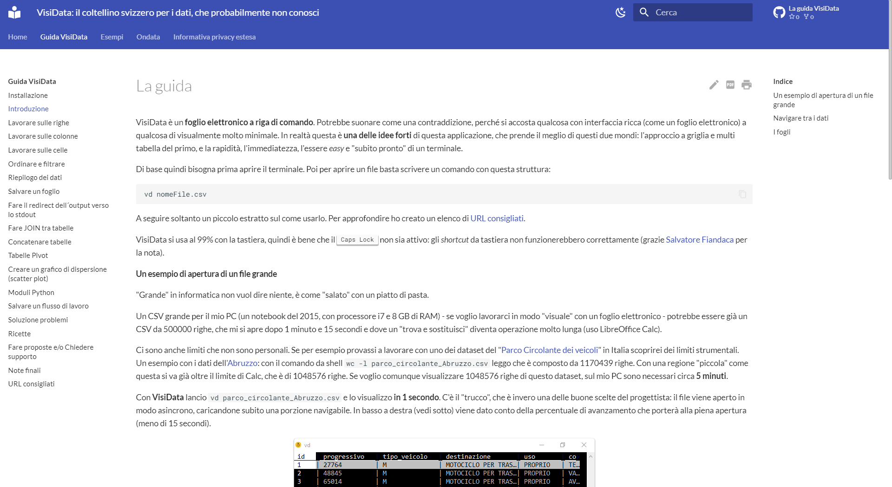

# VisiData: il coltellino svizzero per i dati, che probabilmente non conosci

> **VisiData** è un fantastico strumento _open source_ per esplorare e manipolare dati. Mette insieme la chiarezza di un **foglio di calcolo**, con l'efficienza del **terminale** e la potenza di **Python**, in una _utility_ leggera in grado di gestire milioni di righe con facilità.

La presentazione ufficiale fa un'ottima sintesi, ma non evidenzia la cosa che mi ha colpito di più:  quella di [**Saul Pwanson**](http://saul.pw/) (il creatore di VisiData) è prima di ogni altra cosa una **grande idea**. Lo si capisce usandolo e spero che emerga anche dalle righe seguenti.

Per usarlo **non è necessario essere uno sviluppatore**; se si conosce un po' Python, sarà possibile usarlo in modo ancora più sorprendente.

## Perché usarlo

- È **rapido**, apre quasi istantaneamente file di diverse decine di **megabyte**;
- è **agile**, rende semplice la **ricerca**, il **filtraggio**, l'**ordinamento**,il _**join**_ e la ristrutturazione  di dati tabellari;
- consente di **avere in pochi passaggi** una **visione di insieme dei dataset** su cui si vuole lavorare;
- apre **molti** dei **formati** **tipici** di testo strutturato (csv, tsv,  xlsx , xls, json, xml, sqlite, shp, html, hdf5, xpt, sas7bdat, sav, dta)
- si utilizza **soltanto da tastiera**, ed è possibile dimenticarsi del mouse;
- è free ed _**open source**_.

Apprezzo molto la sua rapidità e come offra in modo agile una visione di insieme sui dati. Questo, affiancato all'utilizzo da tastiera, lo rende un prodotto che dà una marcia in più a chi lo usa.

## Supportarne lo sviluppo

Se VisiData vi piacerà e lo utilizzerete, sarà cosa buona **supportarne lo sviluppo con una donazione**. Io ho deciso di farlo e di esserne un "patrono"!

Si fa da qui [https://www.patreon.com/saulpw](https://www.patreon.com/saulpw).

## Come si installa

Per gli sviluppatori, per chi usa la riga di comando, [è molto facile](http://visidata.org/install/). È scritto in _Python 3_ e di base basta usare l'installer di Python:

    pip3 install visidata

Per tutti gli altri, bisogna prima installare _Python 3_, poi aprire il terminale e lanciare il comando di sopra. 
Su Windows non c'è ancora un supporto diretto. È però utilizzabile da chi ha Windows 10: c'è da installare il Windows Linux Subsystem ([decine di guide per farlo](https://www.google.it/search?q=installare+bash+su+windows+10&rlz=1C1GGRV_itIT742IT742&source=lnt&tbs=qdr:y&sa=X&ved=0ahUKEwj3xd7p5rrfAhVJ-6QKHarKC90QpwUIJg&biw=1680&bih=907)), poi installare _Python 3_ nel sistema Linux e infine dare il comando di sopra dal terminale di Linux.

## Cheat-sheet

Abbiamo tradotto in italiano il *cheat-sheet* di VisiData, creato da Jeremy Singer Vine, disponibile in [HTML](https://jsvine.github.io/visidata-cheat-sheet/it/) e [PDF](https://jsvine.github.io/visidata-cheat-sheet/downloads/visidata-cheat-sheet.it.pdf).

### La versione fronte retro a cura di Gianni Vitrano

[**Gianni Vitrano**](https://twitter.com/gbvitrano) di [OpenDataSicilia](https://twitter.com/opendatasicilia) a partire da questo cheat-sheet, ha creato la versione da stampare [fronte retro a "libretto"](./risorse/cheat-sheet_DaStampareFronteRetro_di_GianniVitrano.pdf). Grazie Gianni!

## 10 Modi di usare Visidata

[**Dieci esempi rapidi**](./dieci_modi_di_usare_visidata.md), che mostrano cosa è possibile fare con VisiData. È una sezione a cura di [**Salvatore Fiandaca**](https://twitter.com/totofiandaca) (grazie).

## [Guida](https://gbvitrano.github.io/guidaVisiData/) in versione html e pdf con [Material for MkDocs](https://squidfunk.github.io/mkdocs-material/)

